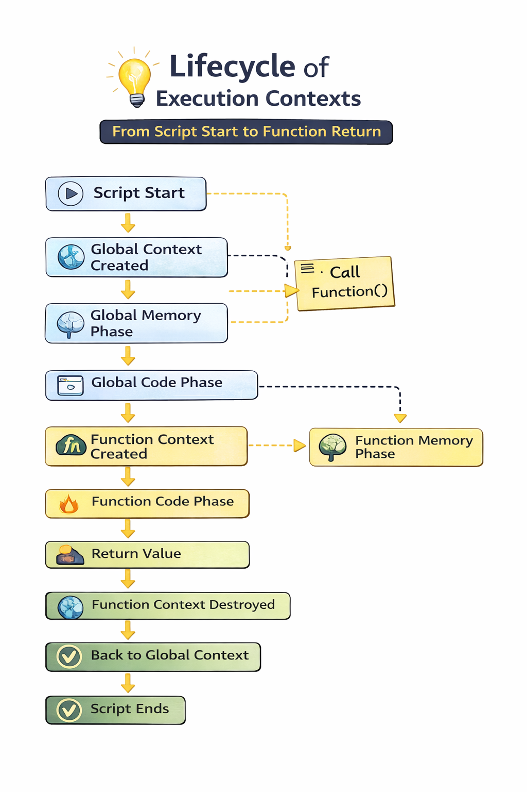
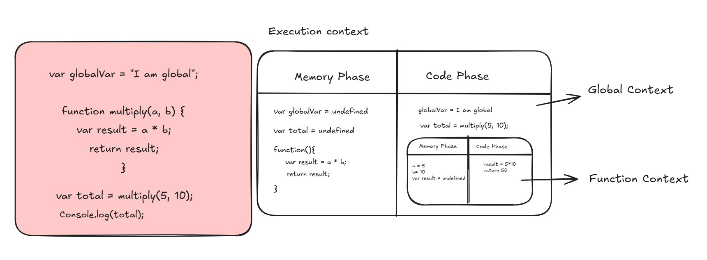

# Execution Context with Diagram Notes

---

## 1. What Is Execution Context?

An **Execution Context** is the environment where JavaScript code is evaluated and executed.

JavaScript mainly uses two execution contexts:
1. **Global Execution Context (GEC)**
2. **Function Execution Context (FEC)**

---

## 2. Global Execution Context (GEC)

The **Global Execution Context** is created first when the JavaScript file starts.

It includes:
- Global object (`window` in browser, `global` in Node.js)
- `this` binding
- Memory for global variables and function declarations

### GEC Phases
1. **Creation Phase**
- `var` is initialized as `undefined`
- `let` and `const` are hoisted but remain in TDZ
- Function declarations are stored fully

2. **Execution Phase**
- Code runs line by line
- Variables get assigned values
- Functions are called

---

## 3. Function Execution Context (FEC)

A **Function Execution Context** is created every time a function is invoked.

It includes:
- Local variable environment
- `this` binding (depends on how function is called)
- Access to outer lexical scope

When a function finishes, its context is removed from the call stack.

---

## 4. Example Code (GEC + FEC)

```js
console.log(a); // undefined
// console.log(b); // ReferenceError (TDZ)

var a = 10;
let b = 20;

function greet() {
  console.log("Hello from greet");
}

greet();
```

---

## 5. Diagram: Execution Context Overview



**Figure 1:** High-level lifecycle of execution contexts from script start to function return.

---

## 6. Diagram: Global vs Function Execution Context



**Figure 2:** Comparison of how GEC and FEC are created and executed.

### Global Execution Context (GEC)

When the file starts, JavaScript creates the GEC first. The GEC runs in two phases.

#### Phase 1: Memory Phase (Creation)
Before executing lines, JavaScript allocates memory:
- `globalVar -> undefined`
- `multiply -> full function definition`
- `total -> undefined`

**Important points:**
- `var` variables are initialized to `undefined`.
- Function declarations are hoisted with full bodies.
- No runtime statements execute yet.

#### Phase 2: Code Phase (Execution)
JavaScript executes statements in order:
1. `globalVar = "I am global"` assigns the value.
2. `var total = multiply(5, 10)` invokes `multiply`.
3. A new **Function Execution Context** is created.
4. Function returns a value, assigned to `total`.
5. `console.log(total)` prints `50`.

### Function Execution Context (multiply)

When `multiply(5, 10)` is called, JavaScript creates a separate function context.

#### Phase 1: Memory Phase (Inside Function)
- `a -> 5` (parameter value)
- `b -> 10` (parameter value)
- `result -> undefined`

#### Phase 2: Code Phase (Inside Function)
```js
result = a * b; // 50
return result;  // returns 50
```

After return:
- `50` goes back to the GEC.
- Function context is removed from the call stack.

### Final Flow Summary
1. Global context is created.
2. Global memory phase completes.
3. Global code phase starts.
4. Function is called; function context is created.
5. Function memory phase and code phase run.
6. Function returns `50`.
7. `total` becomes `50`.
8. `console.log(total)` outputs `50`.

---


## 7. Quick Explanation Script (for Teaching)

Use this when presenting:

1. "Execution context is where JS code runs."
2. "There are two main types: Global Execution Context and Function Execution Context."
3. "Global context is created first and sets up memory for global variables and functions."
4. "Whenever a function is called, a new function execution context is created."
5. "After function execution ends, control returns to the global context."
